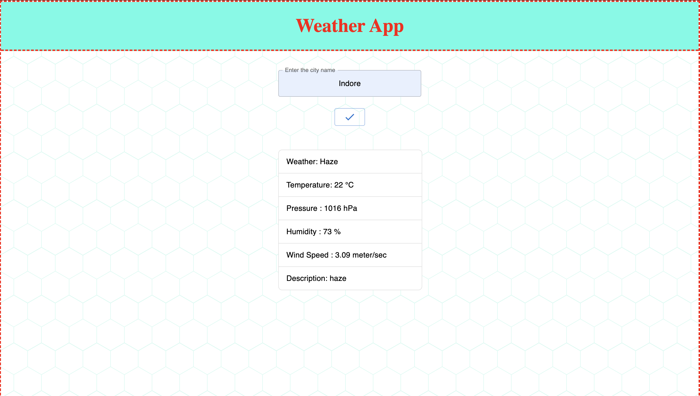

The weather application is hosted at the link - [Weather App](https://abhinavpatel271.github.io/codeX_weatherApp/)  
The main html file in in the root directory with the file name as index.html  
The styling css file is in the src folder and jsx files are also present in the src folder , there are three jsx files.  
The flow of the code is as -  
               --> styles.css  
index.html --->  
               -->index.jsx -> App.jsx -> Weather.jsx  

The screenshot of the web application :-  

             

 
